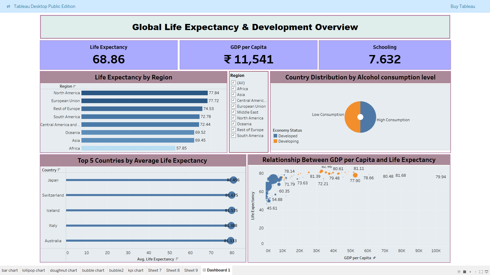

# Global Life Expectancy & Development Overview(Tableau Dashboard)

This dashboard provides a visual analysis of global life expectancy, GDP per capita, population, and development indicators across countries and years.

## Features:
- Life Expectancy by Country and Year  
- GDP per Capita Comparison  
- Population Insights  
- Income Level and Region Filters  
- Interactive Bubble & Line Charts  

## Tools Used:
- Tableau  
- CSV Dataset 

## Objective:
To explore the relationship between life expectancy and socio-economic factors like income, GDP, and population trends worldwide.

